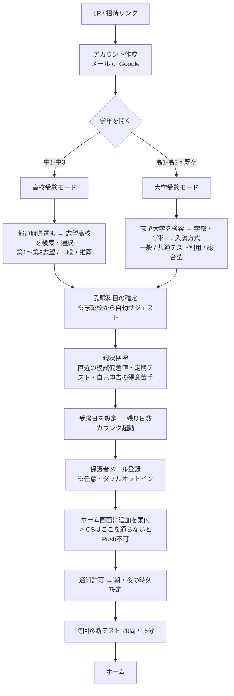
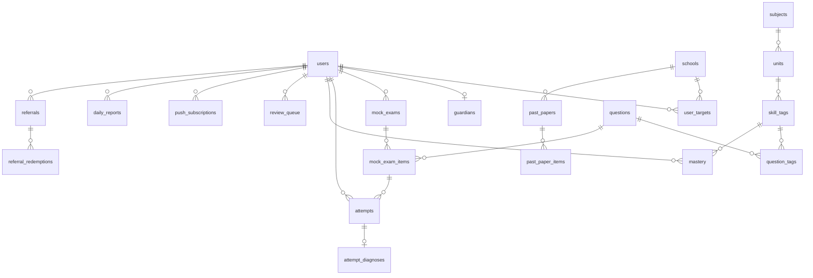
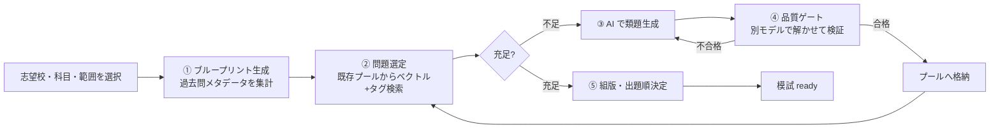
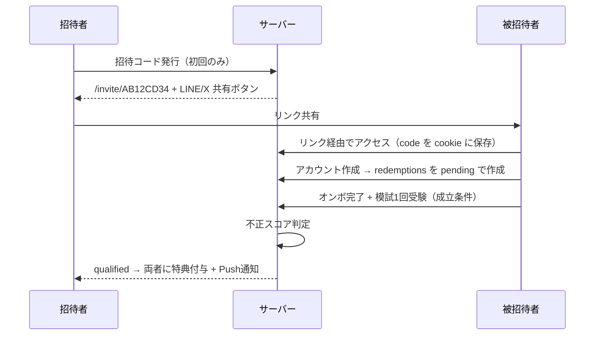

# 入試AIアプリ 設計書

> 対象: 高校受験（中1〜中3）／大学受験（高1〜高3・既卒）
> 形態: PWA（Webアプリ・ホーム画面登録対応）

---

## 0. 要件と設計の対応表

| # | 要件 | 対応する設計セクション |
|---|------|----------------------|
| 1 | 学年を聞く | §2 オンボーディング / §4 `users.grade_level` |
| 2 | 行きたい高校・大学を選択 | §2 / §4 `schools`, `user_targets` |
| 3 | 過去問から模試作成 | §1 権利設計 / §5 模試生成パイプライン |
| 4 | 苦手科目の洗い出しと徹底復習 | §6 習熟度推定エンジン / §7 復習ループ |
| 5 | WEBアプリ＋ホーム画面登録 | §9 PWA設計 |
| 6 | 友達紹介機能 | §10 リファラル設計 |
| 7 | 親に一日の成果をメール送信 | §11 保護者レポート設計 |
| 8 | 朝・夜にAIが促す | §12 通知エンジン |

---

## 1. 最重要の前提設計 — 過去問の権利分離

入試問題は著作物であり、特に国語・英語の長文には**大学以外の第三者（原著者）の著作権**が含まれます。赤本等が成立しているのは出版社が個別に許諾処理をしているためで、Webアプリで無断配信すると差止・損害賠償のリスクがあります。

一方、**「2024年度 ◯◯大 数学は 微積40点・確率30点・整数30点、120分、大問4題」というメタデータは事実の集合であり著作権が及びません。**

そこで本アプリはデータを2層に分けます。

```
┌─────────────────────────────────────────────┐
│ 層A: 過去問メタデータ（著作権フリー）           │
│  出題分野・設問形式・配点・制限時間・難易度      │
│  → 「傾向」の解析に使う。ユーザーには数値で見せる │
└─────────────────────────────────────────────┘
                    ↓ ブループリント生成
┌─────────────────────────────────────────────┐
│ 層B: 配信する問題本文                          │
│  ① AI生成の類題（MVPはこれ100%）               │
│  ② 自作問題                                   │
│  ③ 大学が公式に二次利用を認めた公開問題          │
│  ④ 許諾取得済み問題（将来）                     │
│  → questions.license_status で配信可否を制御    │
└─────────────────────────────────────────────┘
```

**この分離により「◯◯大の傾向を完全再現した模試」というコア価値を維持したまま、権利リスクをゼロにできます。** 層Bの `license_status` を DB レベルの制約にしておくことで、将来③④を扱う際も事故を防げます。

過去問メタデータの収集は、大学公式サイトの公開PDF・入試要項・市販過去問集の**目次/分析ページ**から人手＋AIで構造化します（本文は取り込まない）。

---

## 2. ユーザーフロー

### 2.1 オンボーディング（要件1・2）



**設計上のポイント**

- **学年は「今の学習範囲の上限」と「残り日数」の両方を決める鍵**。中3の8月に高校範囲の問題を出さない、高1に共通テスト形式を出さない、といった出題制御に直結します。
- **学年 → 志望校リストの絞り込み**を行う。中学生に大学一覧を見せない。
- **志望校 → 受験科目の自動サジェスト**。「◯◯大 経済学部（一般）なら 英・数IA IIB・国（現代文のみ）」を初期値として提示し、ユーザーは修正するだけ。ここを手入力にすると離脱します。
- **初回診断テストはオンボーディングの最後に置く**。先に置くと登録前に離脱します。20問程度で全単元を粗くカバーし、§6 の習熟度事前分布を作ります。

### 2.2 デイリーループ

```
朝 7:00 通知 →「今日のミッション（推定12分）」→ 復習3問
   ↓
放課後/夜 学習セッション（模試 or 弱点ドリル）
   ↓
夜 21:00 通知 →「今日の振り返り」→ 未消化タスクがあれば促し
   ↓
21:30 保護者へ日次レポート自動送信
```

---

## 3. 画面設計

| 画面 | パス | 内容 |
|------|------|------|
| ホーム | `/` | 受験まで残り◯日 / 今日のミッション / 連続学習日数 / 弱点トップ3 / 次の模試 |
| 模試一覧 | `/mock` | 作成済み模試、新規作成ボタン |
| 模試作成 | `/mock/new` | 志望校・科目・範囲・時間を選択 → 生成ジョブ投入 |
| 模試受験 | `/mock/[id]/take` | タイマー、設問ナビ、見直しフラグ、自動保存 |
| 模試結果 | `/mock/[id]/result` | 得点・志望校配点換算・分野別正答率・設問別解説 |
| 苦手分析 | `/weakness` | 単元別習熟度レーダー／ヒートマップ、誤答タイプ内訳 |
| 徹底復習 | `/review` | 復習キュー（間隔反復）、単元別の5ステップ復習 |
| 成績推移 | `/progress` | 習熟度の時系列、志望校判定の推移 |
| 友達紹介 | `/invite` | 招待コード・リンク・SNS共有、達成状況 |
| 設定 | `/settings` | 保護者メール、通知時刻、志望校変更、退会 |

**画面設計の指針**

- ホームは**「今なにをやればいいか」1つに絞る**。選択肢を並べると何もしないまま閉じられます。
- 模試受験画面は**オフラインでも解答が消えない**こと（IndexedDB に自動保存 → 復帰時に同期）。試験中に電波が切れて解答が飛ぶのは致命的です。
- 苦手分析は**「弱い」で終わらせず必ず次の行動ボタンを置く**（「この単元を復習する」）。

---

## 4. データモデル



### 4.1 主要テーブル定義

```sql
-- ユーザー（生徒）
create table users (
  id            uuid primary key default gen_random_uuid(),
  auth_id       uuid unique not null,              -- Supabase Auth
  display_name  text not null,
  grade_level   text not null,                     -- 'jhs1'..'jhs3','hs1'..'hs3','ronin'
  exam_track    text not null,                     -- 'highschool' | 'university'
  exam_date     date,                              -- 本番入試日 → 残り日数
  timezone      text not null default 'Asia/Tokyo',
  is_minor      boolean not null default true,     -- 保護者同意フローの分岐
  created_at    timestamptz not null default now()
);

-- 学校マスタ（高校・大学）
create table schools (
  id            uuid primary key,
  type          text not null,                     -- 'highschool' | 'university'
  name          text not null,
  name_kana     text not null,                     -- かな検索用
  prefecture    text,                              -- 高校で必須
  is_national   boolean,                           -- 国公私立
  deviation     numeric(4,1),                      -- 偏差値目安
  search_vector tsvector                           -- 全文検索
);

create table school_departments (                  -- 大学のみ: 学部・学科
  id            uuid primary key,
  school_id     uuid references schools(id),
  faculty       text not null,                     -- 学部
  department    text,                              -- 学科
  admission_type text not null                     -- '一般'|'共テ利用'|'総合型'|'学校推薦'
);

-- 志望校（第1〜第3志望）
create table user_targets (
  id            uuid primary key,
  user_id       uuid references users(id) on delete cascade,
  school_id     uuid references schools(id),
  department_id uuid references school_departments(id),
  priority      smallint not null,                 -- 1=第一志望
  exam_subjects jsonb not null,                    -- [{subject_id, weight_points}]
  unique (user_id, priority)
);

-- ▼ 層A: 過去問メタデータ（本文を持たない）
create table past_papers (
  id            uuid primary key,
  school_id     uuid references schools(id),
  department_id uuid,
  year          smallint not null,
  subject_id    uuid references subjects(id),
  time_limit_min smallint not null,
  total_points  smallint not null,
  notes         text                               -- 「大問4題・全記述」等
);

create table past_paper_items (
  id            uuid primary key,
  paper_id      uuid references past_papers(id) on delete cascade,
  item_no       text not null,                     -- '大問2(1)'
  unit_ids      uuid[] not null,                   -- 出題単元
  format        text not null,                     -- 'mark'|'short'|'essay'|'proof'
  points        smallint not null,
  difficulty    smallint not null,                 -- 1-10
  est_time_sec  integer
);
-- ※ 本文カラムは意図的に存在しない（§1）

-- ▼ 層B: 配信する問題プール
create table questions (
  id            uuid primary key,
  source_type   text not null,                     -- 'ai_generated'|'self_authored'|'official_open'|'licensed'
  license_status text not null default 'blocked',  -- 'deliverable'|'blocked'|'review_pending'
  license_note  text,
  subject_id    uuid references subjects(id),
  difficulty    smallint not null,
  format        text not null,
  body_md       text not null,
  choices       jsonb,                             -- 選択式のみ
  answer        jsonb not null,
  explanation_md text not null,
  rubric        jsonb,                             -- 記述式の採点基準
  est_time_sec  integer not null,
  embedding     vector(1536),                      -- 類題検索
  quality_score numeric(3,2),                      -- §5.3 検証スコア
  verified_at   timestamptz,
  created_at    timestamptz not null default now(),
  -- 配信可能なのは権利確認済みのみ（DB レベルで事故を防ぐ）
  constraint deliverable_requires_license
    check (license_status <> 'deliverable' or source_type in ('ai_generated','self_authored','official_open','licensed'))
);

-- 単元タグ階層: subjects > units > skill_tags
create table subjects   (id uuid primary key, code text unique, name text, exam_track text);
create table units      (id uuid primary key, subject_id uuid, parent_id uuid, name text, grade_from text, sort smallint);
create table skill_tags (id uuid primary key, unit_id uuid, name text);  -- 例:「二次関数の場合分けによる最大最小」

-- 模試
create table mock_exams (
  id            uuid primary key,
  user_id       uuid references users(id) on delete cascade,
  target_id     uuid references user_targets(id),
  subject_id    uuid references subjects(id),
  title         text not null,
  blueprint     jsonb not null,                    -- §5.1 の設計図
  status        text not null,                     -- 'generating'|'ready'|'in_progress'|'submitted'|'graded'|'failed'
  time_limit_min smallint not null,
  total_points  smallint not null,
  started_at    timestamptz,
  submitted_at  timestamptz
);

create table mock_exam_items (
  id            uuid primary key,
  mock_exam_id  uuid references mock_exams(id) on delete cascade,
  order_no      smallint not null,
  question_id   uuid references questions(id),
  points        smallint not null
);

-- 解答
create table attempts (
  id            uuid primary key,
  user_id       uuid references users(id) on delete cascade,
  question_id   uuid references questions(id),
  mock_item_id  uuid references mock_exam_items(id),
  context       text not null,                     -- 'mock'|'review'|'drill'|'diagnostic'
  answer_raw    jsonb not null,
  is_correct    boolean,
  awarded_points numeric(5,2),
  time_spent_sec integer not null,
  self_confidence smallint,                        -- 1-4 自己申告（ケアレスミス判定に効く）
  created_at    timestamptz not null default now()
);

-- 誤答タイプ診断（AI）
create table attempt_diagnoses (
  attempt_id    uuid primary key references attempts(id) on delete cascade,
  error_type    text not null,                     -- 'knowledge_gap'|'procedure'|'calculation'|'misread'|'timeout'|'careless'
  root_skill_id uuid references skill_tags(id),    -- 真の原因となる前提スキル
  comment_ja    text not null,
  model         text not null,
  created_at    timestamptz not null default now()
);

-- 習熟度（ベータ分布で保持）
create table mastery (
  user_id       uuid references users(id) on delete cascade,
  skill_tag_id  uuid references skill_tags(id),
  alpha         numeric(8,3) not null default 1,   -- 正答の擬似カウント
  beta          numeric(8,3) not null default 1,   -- 誤答の擬似カウント
  mastery       numeric(4,3) generated always as (alpha / (alpha + beta)) stored,
  sample_size   integer not null default 0,
  updated_at    timestamptz not null default now(),
  primary key (user_id, skill_tag_id)
);

-- 復習キュー（FSRS 準拠）
create table review_queue (
  id            uuid primary key,
  user_id       uuid references users(id) on delete cascade,
  skill_tag_id  uuid references skill_tags(id),
  due_at        timestamptz not null,
  state         text not null default 'new',       -- 'new'|'learning'|'review'|'relearning'
  stability     numeric(8,3),
  difficulty    numeric(4,2),
  reps          smallint not null default 0,
  lapses        smallint not null default 0
);
create index on review_queue (user_id, due_at) where state <> 'suspended';

-- 保護者
create table guardians (
  id            uuid primary key,
  user_id       uuid references users(id) on delete cascade,
  email         text not null,
  relation      text,                              -- '母'|'父'|'その他'
  verify_token  text unique,
  verified_at   timestamptz,                       -- ダブルオプトイン完了
  consent_at    timestamptz,                       -- 未成年の個人情報取扱同意
  unsubscribe_token text unique not null,
  report_enabled boolean not null default true,
  report_hour   smallint not null default 21,
  report_weekdays smallint[] default '{1,2,3,4,5,6,0}',
  bounced_at    timestamptz,
  unique (user_id, email)
);

create table daily_reports (
  id            uuid primary key,
  user_id       uuid references users(id) on delete cascade,
  report_date   date not null,
  stats         jsonb not null,                    -- 学習時間/問題数/正答率/伸びた単元
  summary_ja    text not null,                     -- AI生成の保護者向け文面
  email_status  text,                              -- 'sent'|'skipped'|'bounced'|'failed'
  sent_at       timestamptz,
  unique (user_id, report_date)
);

-- 通知
create table notification_prefs (
  user_id       uuid primary key references users(id) on delete cascade,
  morning_time  time not null default '07:00',
  evening_time  time not null default '21:00',
  push_enabled  boolean not null default true,
  email_enabled boolean not null default false,
  quiet_weekdays smallint[] default '{}',
  auto_tune     boolean not null default true      -- §12.3 時刻の自動最適化
);

create table push_subscriptions (
  id            uuid primary key,
  user_id       uuid references users(id) on delete cascade,
  endpoint      text unique not null,
  p256dh        text not null,
  auth          text not null,
  user_agent    text,
  failure_count smallint not null default 0,
  last_success_at timestamptz
);

create table notification_logs (
  id            uuid primary key,
  user_id       uuid,
  channel       text not null,                     -- 'push'|'email'
  kind          text not null,                     -- 'morning'|'evening'|'streak'|'guardian_report'
  scheduled_for timestamptz not null,
  sent_at       timestamptz,
  opened_at     timestamptz,
  unique (user_id, kind, scheduled_for)            -- 二重送信の防止
);

-- 友達紹介
create table referrals (
  id            uuid primary key,
  inviter_id    uuid references users(id) on delete cascade,
  code          text unique not null,              -- 8桁 base32
  created_at    timestamptz not null default now()
);

create table referral_redemptions (
  id            uuid primary key,
  referral_id   uuid references referrals(id),
  invitee_id    uuid unique references users(id),  -- 1人1回のみ
  status        text not null default 'pending',   -- 'pending'|'qualified'|'rewarded'|'rejected'
  signup_ip_hash text,
  device_hash   text,
  fraud_score   numeric(3,2),
  qualified_at  timestamptz,
  rewarded_at   timestamptz
);

create table streaks (
  user_id       uuid primary key references users(id) on delete cascade,
  current       integer not null default 0,
  longest       integer not null default 0,
  last_active   date
);
```

**RLS（Row Level Security）は全ユーザーデータテーブルで必須**。`auth.uid()` による自己レコード限定を既定とし、`questions` のみ `license_status = 'deliverable'` の行を全員読み取り可にします。

---

## 5. 模試生成パイプライン（要件3）

> **出題形式の詳細は [docs/question-format.md](docs/question-format.md) を参照。**
> MVPで配信するのは自動採点可能な2形式のみ（数学＝数値マーク / その他＝5択）。
> 誤答の選択肢・誤答値そのものに診断タグを埋め込むことで、§6.1 の誤答タイプ分類を
> AI呼び出しなしで決定論的に行う。



### 5.1 ① ブループリント生成

志望校の直近5年分の `past_paper_items` を集計して、**出題設計図（JSON）**を作ります。ここはAIではなく**SQLの集計**で決定論的にやります（AIに任せると年ごとにブレて再現性が落ちる）。

```json
{
  "school": "◯◯大学 理工学部",
  "subject": "数学",
  "time_limit_min": 120,
  "total_points": 200,
  "structure": [
    { "no": 1, "format": "short",  "points": 40,
      "unit_distribution": { "微分積分": 0.6, "極限": 0.4 },
      "difficulty_target": 5 },
    { "no": 2, "format": "essay",  "points": 50,
      "unit_distribution": { "確率": 0.8, "数列": 0.2 },
      "difficulty_target": 7 },
    { "no": 3, "format": "proof",  "points": 60,
      "unit_distribution": { "整数": 1.0 },
      "difficulty_target": 8 }
  ],
  "evidence": { "years": [2021,2022,2023,2024,2025], "n_items": 47 }
}
```

**ユーザー価値の見せ方**: 生成前に「◯◯大の数学は 微積が5年連続で大問1、整数の証明が3年連続で出ています」と**根拠を提示**する。これがあると「AIが適当に作った模試」ではなく「分析に基づく模試」として信頼されます。

**個別最適化**: ブループリントに**ユーザーの弱点補正**を掛けます。既定は「本番再現モード（傾向100%）」、オプションで「弱点強化モード（弱点単元の比率を1.5倍）」を選べるようにします。

### 5.2 ② 問題選定

`questions` から `embedding` の近傍検索 + `skill_tags` / `difficulty` / `format` のフィルタで候補を引き、以下を満たすよう選びます。

- ユーザーが直近90日以内に解いた問題は除外
- 同一 skill_tag が偏りすぎないよう制約付き選択（貪欲法で十分）
- 推定所要時間の合計が制限時間の 0.9〜1.1 倍に収まる

### 5.3 ③④ 生成と品質ゲート

**生成が難しいのではなく、品質保証が難しい**のがこの機能の本質です。答えが割れる問題を出すとアプリの信頼が一発で失われます。

- **生成**: Claude に tool use で JSON Schema を強制し、`body_md` / `answer` / `explanation_md` / `rubric` を構造化出力。数式は KaTeX。
- **検証（必須）**: 生成とは**別セッション**で、問題文だけを渡して3回独立に解かせる。
  - 3回とも生成時の `answer` と一致 → `quality_score = 1.0` → 配信可
  - 2/3一致 → 人手レビューキューへ
  - それ以下 → 破棄して再生成（最大3回）
- **追加チェック**: 「解答に必要な情報が問題文に全て含まれているか」「複数解釈できる表現がないか」「指定範囲外の知識を要求していないか（学年チェック）」を別プロンプトで判定。
- 検証を通った問題は**プールに永続化**するため、生成コストは初回のみ。ユーザーが増えるほど1模試あたりのコストは下がります。

### 5.4 ⑤ 採点

- **選択式・短答**: 決定論的に照合（表記ゆれは正規化ルール＋別解リスト）。AIを使わない。
- **記述・証明**: `rubric` に沿って Claude が採点。「配点項目ごとに 得点／根拠／どこまで書けていたか」を返す。**必ず部分点の内訳を見せる**こと。
- 採点結果は `attempts` に保存し、同時に §6 の習熟度更新をトリガ。

---

## 6. 苦手洗い出しエンジン（要件4・前半）

### 6.1 「単元別正答率」では足りない

正答率だけでは「わかっていない」のか「わかっているがミスした」のかが区別できず、復習の処方が間違います。本設計では**2軸で診断**します。

**軸1: 習熟度（ベータ分布による推定）**

各 `skill_tag` について事後分布 Beta(α, β) を持ち、解答のたびに更新します。

```
正答:  α ← α + w
誤答:  β ← β + w
w = 難易度重み × 新しさ重み(時間減衰)
```

- 単純な正答率と違い、**試行回数が少ないときの過信を避けられる**（3問中3問正解でも mastery は 0.8 止まり）。
- 表示は `mastery` の点推定と、95%信用区間の幅で「データ不足」を明示。
- 診断の優先度 = `(1 - mastery) × 志望校での出題頻度 × 配点`。**「苦手 × 出やすい × 配点が高い」順に並べるのが肝**です。苦手でも出ない単元を潰しても点は上がりません。

**軸2: 誤答タイプ分類（AI）**

誤答ごとに、解答内容・所要時間・自己申告確信度から Claude が分類します。

| タイプ | 判定シグナル | 処方 |
|--------|-------------|------|
| `knowledge_gap` 知識欠落 | 手が止まっている／白紙／確信度低 | 前提単元まで遡って講義から |
| `procedure` 手順ミス | 方針は合うが途中で破綻 | 例題の解法パターン反復 |
| `calculation` 計算ミス | 方針・立式は正しい | 計算ドリル・検算習慣 |
| `misread` 読み違い | 設問条件の取り違え | 条件抽出トレーニング |
| `timeout` 時間切れ | 未着手 or 途中で終了 | 時間配分戦略・捨て問判断 |
| `careless` ケアレス | 確信度高 × 誤答 × 短時間 | 見直し手順の定着 |

**根本原因の遡及**: `knowledge_gap` の場合、AIは `root_skill_id` に「本当に欠けている前提スキル」を返します。例）「三角関数の合成ができない」の根本が「加法定理の暗記不足」なら、そこから復習を組み直します。これが「徹底復習」の徹底たる所以です。

### 6.2 見せ方

- 科目別レーダーチャート（大単元レベル）
- 単元ヒートマップ（小単元 × 習熟度、志望校での出題頻度をセルサイズに反映）
- 誤答タイプの円グラフ（「あなたの失点の42%は計算ミス」は行動が変わる強いフィードバック）
- **必ず「この単元を復習する」ボタンを併置**

---

## 7. 徹底復習ループ（要件4・後半）

### 7.1 単元単位の5ステップ

弱点単元1つに対し、AIが以下のセッションを組み立てます。

```
① 診断    3問で現状の穴を特定（前提スキルも含む）
   ↓
② ミニ講義 AIがその生徒の誤答パターンに合わせて解説（3〜5分で読める量）
   ↓
③ 例題    解法を1ステップずつ確認（ヒント段階開示）
   ↓
④ 演習    5〜8問、難易度を漸進的に上げる
   ↓
⑤ 再テスト ①と同難度・別問題 → 習熟度を再測定
   ↓
   合格(mastery ≥ 0.8) → 復習キューへ登録（間隔反復）
   不合格 → ②へ戻る（前提スキルまで遡る）
```

### 7.2 忘却対策 — 間隔反復（FSRS）

一度できても2週間後には忘れます。`review_queue` に FSRS アルゴリズムで次回復習日を計算して積み、**本番入試日から逆算して最終復習が直前に来るようスケジュールを圧縮**します。

- 通常時: FSRS の標準間隔
- 入試まで30日を切った単元: 間隔上限を7日にクランプ
- 入試まで7日: 全弱点単元を毎日1問ずつ総ざらい

**この「入試日から逆算する」点が汎用の暗記アプリとの差別化になります。**

### 7.3 今日のミッション生成

毎朝、以下から**推定10〜20分**に収まるようタスクを選びます。

1. `review_queue` で `due_at <= 今日` のもの（優先度最高）
2. 優先度スコア上位の弱点単元の演習
3. 直近の模試で落とした設問の解き直し

---

## 8. 技術スタック

| レイヤ | 採用 | 理由 |
|--------|------|------|
| フロント | Next.js 15 (App Router) + TypeScript | RSC で初期表示が速く、PWA・Route Handlers も同一プロジェクトで完結 |
| UI | Tailwind CSS + shadcn/ui | 実装速度。スマホ前提のレイアウト |
| 数式 | KaTeX | 数学・理科の問題表示に必須 |
| DB / 認証 | Supabase (Postgres + Auth + RLS + pgvector) | RLS で「他人のデータが見える」事故を DB 層で防げる。ベクトル検索も同一DB |
| ホスティング | Vercel | Next.js との親和性、Cron 内蔵 |
| ジョブ | Vercel Cron + QStash（模試生成の非同期化） | 生成は数十秒〜数分かかるためリクエスト内で完結させない |
| AI | Claude API | §8.1 |
| メール | Resend | 日本語の到達率、React Email でテンプレート管理 |
| Push | web-push (VAPID) | 追加サービス不要 |
| 決済（将来） | Stripe | |
| 監視 | Sentry + Vercel Analytics | |

**代替案**: コストを抑えるなら Cloudflare Workers + D1 + Vectorize + Cloudflare Email Service + Cron Triggers。ただし Supabase の RLS と Auth を自前実装する分、初速は落ちます。**MVPは Supabase + Vercel を推奨**。

### 8.1 モデルの使い分け

| 用途 | モデル | 理由 |
|------|--------|------|
| 問題生成・記述採点・根本原因診断 | `claude-opus-5` | 品質が直接プロダクト価値。ここはケチらない |
| 解説生成・ミニ講義・保護者レポート文面 | `claude-sonnet-5` | 品質とコストのバランス |
| 誤答タイプ分類・タグ付け・通知文 | `claude-haiku-4-5-20251001` | 高頻度・軽量。件数が出る |

- **Prompt caching** を活用: 単元タグ体系・出題ブループリント・採点ルーブリックは共通接頭辞に置いてキャッシュする。問題生成のトークン単価が大きく下がります。
- 構造化出力は **tool use**（JSON Schema）で強制し、パース失敗をなくす。

---

## 9. PWA・ホーム画面登録（要件5）

### 9.1 なぜ最優先か

**iOS Safari の Web Push は「ホーム画面に追加された PWA」でしか動きません（iOS 16.4以降）。** つまり要件5は要件8（朝夜の通知）の**前提条件**です。ここを取りこぼすと iPhone ユーザーに通知が一切届きません。日本の中高生は iPhone 比率が高いため、これは致命的です。

### 9.2 実装

```json
// app/manifest.json
{
  "name": "入試AI",
  "short_name": "入試AI",
  "start_url": "/?src=pwa",
  "display": "standalone",
  "background_color": "#ffffff",
  "theme_color": "#2563eb",
  "orientation": "portrait",
  "icons": [
    { "src": "/icon-192.png", "sizes": "192x192", "type": "image/png" },
    { "src": "/icon-512.png", "sizes": "512x512", "type": "image/png" },
    { "src": "/icon-maskable-512.png", "sizes": "512x512", "type": "image/png", "purpose": "maskable" }
  ],
  "shortcuts": [
    { "name": "今日のミッション", "url": "/review/today" },
    { "name": "模試をつくる", "url": "/mock/new" }
  ]
}
```

- Service Worker: `push` / `notificationclick` / オフライン時のシェル配信 / 解答の Background Sync
- **インストール誘導**: OS判定して出し分ける。
  - Android/Chrome → `beforeinstallprompt` を捕まえて独自ボタン
  - **iOS Safari → プロンプトAPIが無いので、共有ボタン→「ホーム画面に追加」の手順を図解で表示**（ここを文字だけで説明すると誰もやりません）
- 表示タイミングは**オンボーディング完了直後**（価値を体験した直後が最も承諾率が高い）。`display-mode: standalone` を検知して既にインストール済みなら出さない。

---

## 10. 友達紹介（要件6）

### 10.1 フロー



### 10.2 設計上の要点

- **成立条件を「登録」ではなく「オンボ完了＋模試1回受験」に置く**。登録だけを条件にすると捨てアカウントの温床になります。
- **双方向インセンティブ**: 招待者・被招待者ともにプレミアム7日。片側だけだと共有されません。
- **不正対策**:
  - `invitee_id` に unique 制約（1人1回）
  - IP ハッシュ・デバイスフィンガープリントの一致で `fraud_score` を加点
  - 同一招待者の24時間あたり成立上限（例: 5件）
  - `fraud_score` が閾値超えは `rejected` にして手動レビュー
- **共有導線**: LINE が最重要（中高生の主戦場）。X・Instagram ストーリーズ用の画像生成もあると伸びます。
- **見せ方**: 「招待した友達 3人 / あと2人でプレミアム1ヶ月」と進捗を可視化。同じ志望校の友達がいる場合は（本人の同意があれば）匿名の比較を出すと継続率が上がります。

---

## 11. 保護者への日次レポートメール（要件7）

### 11.1 同意設計（最重要）

**利用者は未成年です。保護者のメールアドレスは個人情報であり、かつ「子の学習状況」という要配慮性の高い情報を送るため、同意設計を最初に固めます。**

1. 生徒が保護者のメールアドレスを登録
2. **確認メールを送信**（この時点ではレポートは送らない）
3. 保護者が確認リンクをクリック → `verified_at` 記録
4. 同画面で「子の学習状況の受信」に同意 → `consent_at` 記録
5. 以降レポート送信開始
6. **全メールのフッターに配信停止リンク**（ワンクリックで停止、ログイン不要）

バウンスした場合は `bounced_at` を記録して自動停止（送り続けると送信ドメインのレピュテーションが落ちます）。

### 11.2 送信ジョブ

```
毎日 15分刻みで Cron 起動
  → guardians を report_hour × users.timezone で絞り込み
  → 当日の attempts / study_sessions / mastery差分 を集計
  → 学習実績ゼロの日はどうするか（§11.4）を判定
  → Claude で文面生成
  → Resend で送信
  → daily_reports に記録（unique(user_id, report_date) で二重送信防止）
```

### 11.3 メール内容

```
件名: 【入試AI】8月3日のけいいちろうさんの学習

■ 今日の学習
   学習時間      42分（今週合計 3時間28分）
   解いた問題    28問 / 正答率 71%
   連続学習      12日目

■ 伸びたところ
   数学「二次関数の最大最小」の定着度が 45% → 68% に上がりました。
   苦手だった場合分けの問題を、5問中4問正解しています。

■ いま取り組んでいるところ
   英語「関係代名詞」でつまずいています。
   知識が抜けているというより、長文の中で見落とすケースが多いようです。
   今週中に復習セッションを組んでいます。

■ ご家庭でのひとこと（AIからの提案）
   「二次関数、伸びてるね」と具体的に触れていただけると効果的です。
   英語はまだ途中なので、今は結果より続けていることを見てあげてください。

［今日は学習の記録がありません］の場合の文面は §11.4 参照

──────────
配信を停止する: https://.../unsubscribe?token=...
```

### 11.4 トーン設計 — これを外すとアプリが嫌われる

**保護者レポートは「叱る材料」になった瞬間に、生徒がアプリを使わなくなります。** プロンプトに以下を明示的に制約として入れます。

- 数値は事実として淡々と、**成果は具体的に、不足は「途中」として**書く
- 他の生徒との比較・順位は**書かない**
- 「もっと頑張らせてください」的な**保護者への発破は書かない**
- **学習ゼロの日**は「今日は記録がありませんでした」で終える。理由を推測して書かない。ゼロの日が3日続いたら送信を週次サマリに自動切替（毎日ゼロ通知が届くと親子関係が悪化します）
- 「ご家庭でのひとこと」は**声かけの提案**であり、指示ではない

### 11.5 生徒側のコントロール

生徒が「今日は送らない」を選べるボタンを設けます。監視ツールだと感じさせないためです。ただし**送らなかった事実は保護者に見えない**設計（「今日は非公開です」と出すと逆効果）。この点は運用ポリシーとして明文化し、利用規約にも記載します。

---

## 12. 通知エンジン — 朝・夜のAI促し（要件8）

### 12.1 スケジューリング

Cron を15分刻みで走らせ、「ユーザーのローカル時刻がその窓に入る人」を拾います。タイムゾーンごとに Cron を分けるのは破綻します。

```sql
-- 朝の対象者抽出（15分窓）
select u.id
from users u
join notification_prefs p on p.user_id = u.id
where p.push_enabled
  and (now() at time zone u.timezone)::time
      between p.morning_time and p.morning_time + interval '15 min'
  and extract(dow from now() at time zone u.timezone)::smallint <> all(p.quiet_weekdays)
  and not exists (
    select 1 from notification_logs l
    where l.user_id = u.id and l.kind = 'morning'
      and l.scheduled_for::date = (now() at time zone u.timezone)::date
  );
```

`notification_logs` の `unique(user_id, kind, scheduled_for)` が二重送信を防ぎます。

### 12.2 通知内容

**朝（既定 7:00）— 「今日やること」を1つだけ**

| 状況 | 文面例 |
|------|--------|
| 通常 | 「おはよう。今日は二次関数の復習3問、12分で終わります」 |
| 復習期限あり | 「昨日できた関係代名詞、今日が復習のタイミング。5問だけ」 |
| 模試未着手 | 「◯◯大の模試、まだ途中。残り2問です」 |
| 入試直前期 | 「入試まであと30日。今日は整数の総ざらい」 |

**夜（既定 21:00）— 振り返りと明日の予告**

| 状況 | 文面例 |
|------|--------|
| 達成 | 「今日は28問。二次関数、5問中4問正解でした。明日は英語の長文」 |
| 未達成 | 「今日はまだ0問。3問だけやっておくと、明日の自分が楽になります」 |
| 連続記録 | 「連続11日目。あと3日で2週間です」 |

**設計指針**

- **朝は「今日やること」1つに絞る。夜は「事実 + 小さな次の一歩」。**
- 文面は Claude（haiku）で生成するが、**テンプレート骨格＋変数**にして品質を安定させる。毎回フルに自由生成すると外れ値が出ます。
- **煽らない・責めない**。「サボってますね」系は解約に直結します。未達成時こそハードルを下げる文面にする。
- 週1回（日曜夜）は週次サマリ通知。

### 12.3 通知時刻の自動最適化

`auto_tune` が有効な場合、過去の学習開始時刻の分布から最適な通知時刻を学習します。

- 直近28日の `study_sessions.started_at` のヒストグラムを取り、最頻帯の30分前に朝通知を寄せる
- 通知の `opened_at` / 通知後60分以内の学習開始率を報酬として、ε-greedy（ε=0.1）で時刻候補を探索
- ユーザーが手動で時刻を設定した場合は自動調整を停止

### 12.4 フォールバック

- Push 購読が無い／`failure_count >= 3` のユーザーには、本人同意があればメールで代替
- 通知権限を拒否したユーザーには、アプリ起動時にホームで「今日のミッション」を強調表示

---

## 13. セキュリティ・プライバシー

利用者の大半が未成年であるため、通常のWebアプリより一段厳しい設計にします。

| 項目 | 方針 |
|------|------|
| 認可 | 全ユーザーデータテーブルで Supabase RLS を有効化。アプリ層のチェックだけに依存しない |
| 未成年の同意 | 16歳未満は保護者同意を前提とする設計。登録時に生年月を取得し `is_minor` を判定 |
| 保護者メール | ダブルオプトイン必須（§11.1）。未検証アドレスには一切送信しない |
| データ最小化 | 成績・志望校は要配慮性が高い。第三者提供なし、分析用途は集計値のみ |
| 退会 | 30日以内に全データ物理削除。保護者からの削除請求にも対応する導線を用意 |
| トークン | `verify_token` / `unsubscribe_token` は 128bit ランダム、推測不可・期限付き |
| AI入力 | 生徒の解答をモデルに送る。学習利用されない設定であることを規約に明記 |
| 秘匿情報 | API キーはサーバー環境変数のみ。VAPID 秘密鍵をクライアントに出さない |
| レート制限 | 模試生成は「1日◯回まで」。AI呼び出しのコスト暴発と悪用を防ぐ |
| 監査ログ | 保護者レポートの送信履歴を保持（「勝手に送られた」への説明責任） |

---

## 14. API 設計（抜粋）

```
POST   /api/onboarding                 学年・志望校・受験日を保存
GET    /api/schools?q=&type=&pref=     学校検索（かな対応・全文検索）
GET    /api/schools/:id/trend          過去問傾向（ブループリントのプレビュー）

POST   /api/mock-exams                 → 202 { job_id } 非同期生成
GET    /api/mock-exams/:id             状態ポーリング / 模試取得
POST   /api/mock-exams/:id/start       開始（サーバー時刻でタイマー基準を固定）
PATCH  /api/mock-exams/:id/answers     解答の自動保存（部分更新）
POST   /api/mock-exams/:id/submit      提出 → 採点ジョブ
GET    /api/mock-exams/:id/result      結果・解説

GET    /api/weakness                   単元別習熟度＋優先度ランキング
GET    /api/review/today               今日のミッション
POST   /api/review/sessions            復習セッション開始
POST   /api/attempts                   解答記録（習熟度更新をトリガ）

POST   /api/guardians                  保護者メール登録 → 確認メール送信
GET    /api/guardians/verify           確認リンク（トークン）
GET    /api/guardians/unsubscribe      配信停止（ログイン不要）

POST   /api/push/subscribe             Push購読登録
DELETE /api/push/subscribe             解除
PATCH  /api/notification-prefs         通知時刻・曜日

GET    /api/referrals/me               自分の招待コード・成果
POST   /api/referrals/redeem           招待コード適用

# Cron（Vercel Cron / 認証ヘッダ必須）
POST   /api/cron/notify        */15 * * * *   朝夜通知
POST   /api/cron/daily-report  */15 * * * *   保護者レポート
POST   /api/cron/reconcile     0 3 * * *      連続日数・特典・失効処理
```

**模試生成を非同期にする理由**: 問題生成＋検証で数十秒〜数分かかります。リクエスト内で完結させるとタイムアウトします。`status: generating` を返して画面はポーリング（またはSupabase Realtime）で待ち、生成中は「◯◯大の傾向を分析しています」と進捗を見せます。

---

## 15. 開発フェーズ

| Phase | 期間目安 | 内容 | 完了条件 |
|-------|---------|------|---------|
| **0** | 2週 | DBスキーマ、認証、オンボーディング（要件1・2）、PWA基盤（要件5）、学校マスタ投入 | ホーム画面に追加でき、志望校が登録できる |
| **1** | 3週 | 単元タグ体系、問題生成＋品質ゲート、模試生成・受験・自動採点（選択/短答）（要件3） | 志望校の傾向に沿った模試が1本通る |
| **2** | 2週 | 習熟度推定、誤答タイプ分類、苦手可視化、復習ループ、FSRS（要件4） | 弱点が出て、復習セッションが回る |
| **3** | 2週 | Push通知（朝夜）、保護者メール、Cron基盤（要件7・8） | 朝夜の通知と日次レポートが実運用で届く |
| **4** | 1週 | 友達紹介、不正対策（要件6） | 招待→成立→特典付与が通る |
| **5** | — | 記述採点、成績推移・志望校判定、課金、指導者向け機能 | |

**Phase 0 で PWA を先に入れる理由**: iOS の Push がホーム画面追加を前提とするため（§9.1）、後回しにすると Phase 3 で通知が届かず設計をやり直すことになります。

**先に手を付けるべきリスク**: ①問題生成の品質（§5.3 の検証ゲートを Phase 1 の最初に作る。ここが通らないとプロダクトが成立しない）、②学校マスタと過去問メタデータの収集コスト（Phase 0 で第一志望になりやすい上位100校に絞って着手）。

---

## 16. 未確定事項（決めていただきたい点）

1. **対象範囲**: 高校受験・大学受験の両方を初期から扱うか、どちらかに絞るか（絞るほうがタグ体系と学校マスタの初期コストが大幅に下がります）
2. **科目範囲**: 全5教科か、数学・英語から始めるか（記述採点の難度は 国語 > 英語 > 数学 の順に高い）
3. **収益モデル**: 無料＋プレミアム課金か、買い切りか、無料か（紹介特典の設計が変わります）
4. **過去問メタデータの調達**: 手作業でどこまで揃えるか、対象校の初期リスト
5. **保護者レポートの既定値**: オプトイン（既定オフ）／オプトアウト（既定オン）のどちらにするか。**オプトイン推奨**
